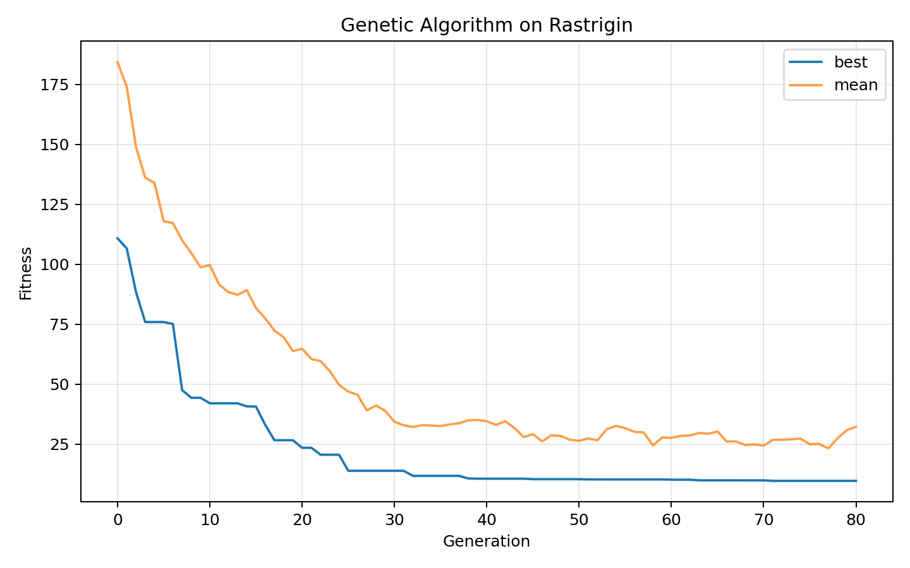
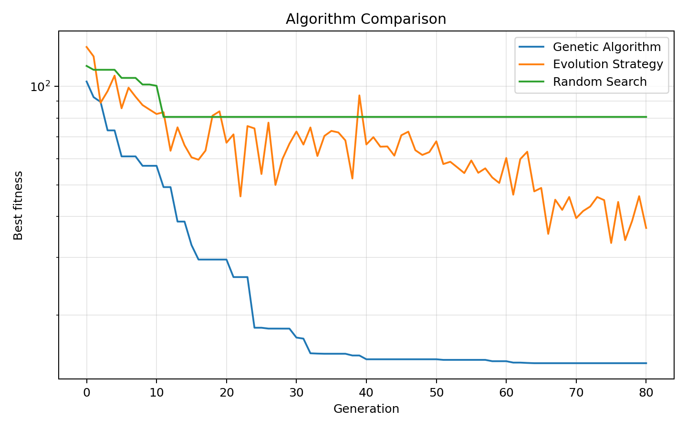
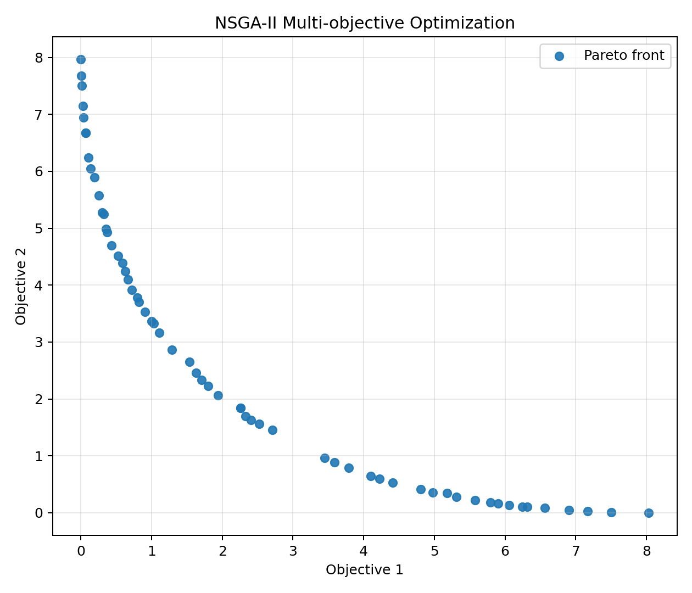
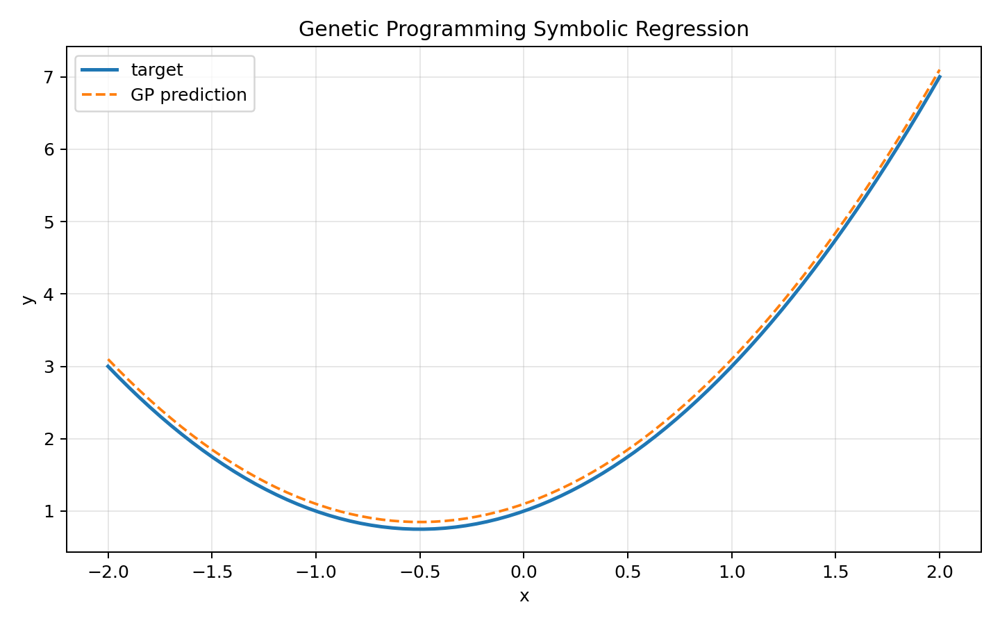
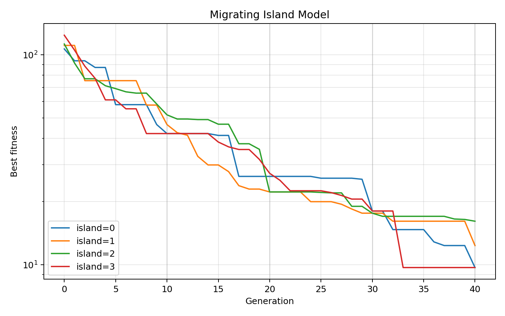
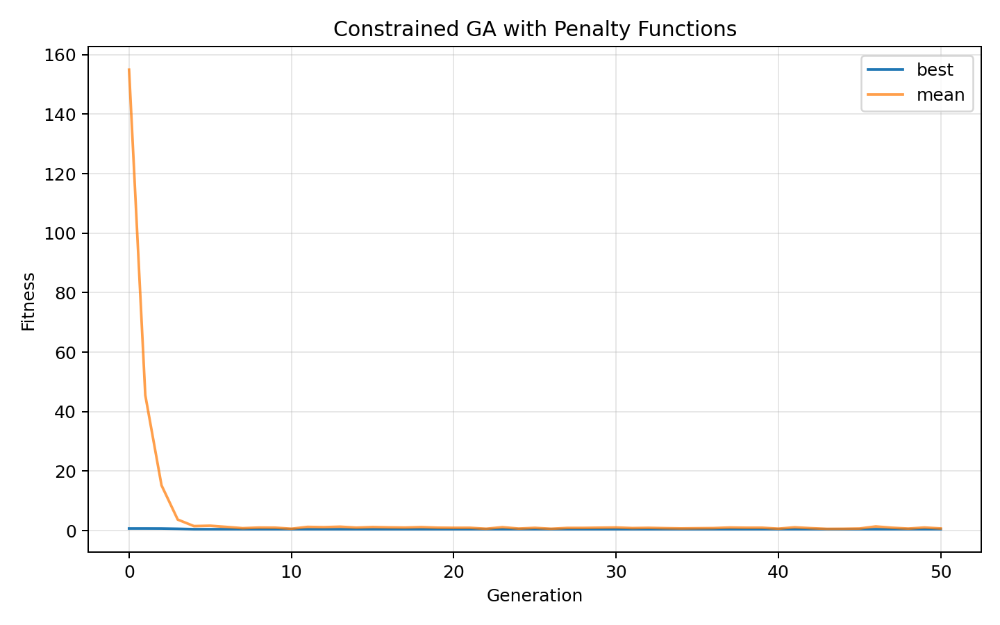
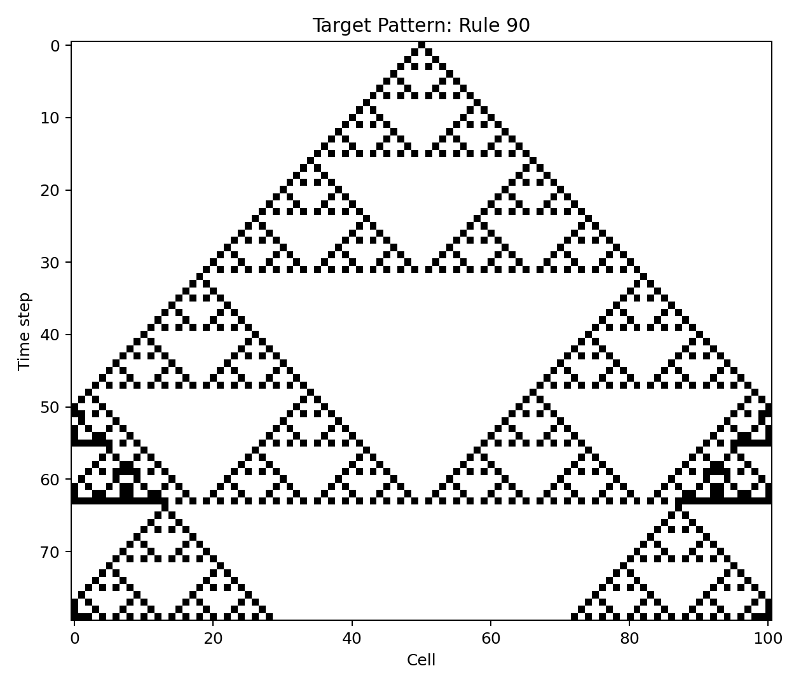
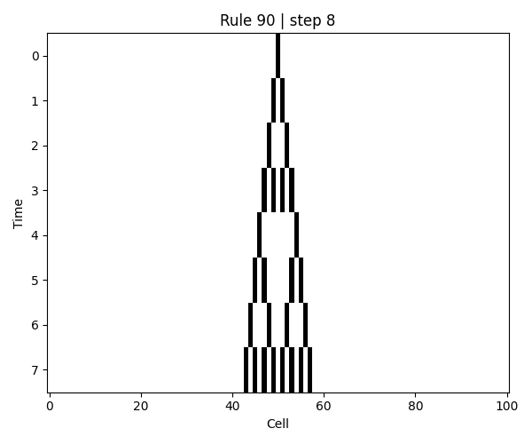
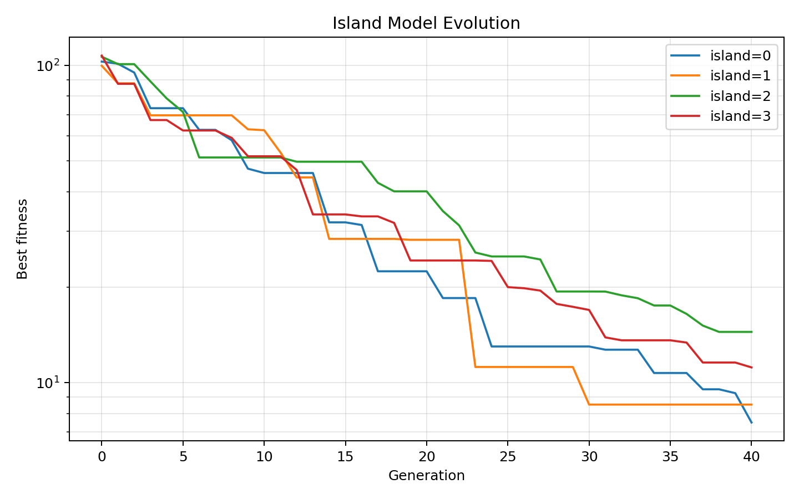

# Evolutionary Computation Lab

This repository contains small, local evolutionary computation experiments written for educational and portfolio purposes.

The project focuses on search, optimization, and artificial-life-style rule discovery. It includes a from-scratch genetic algorithm, an evolution strategy, random-search baselines, multi-objective optimization, genetic programming, migrating island models, constrained optimization with penalty functions, and evolutionary search for cellular automaton rules.

## Overview

Implemented experiments:

- From-scratch Genetic Algorithm for continuous optimization
- Evolution Strategy baseline
- Random Search baseline
- Algorithm comparison plots
- Island-model evolutionary search
- Real ring migration between islands
- Multi-objective optimization with a compact NSGA-II style implementation
- Genetic programming for symbolic expression discovery
- Constraint handling with quadratic penalty functions
- Evolutionary search for elementary cellular automaton rules
- Fitness curves, CSV summaries, JSON best solutions, PNG plots, and GIF animation
- Streamlit viewer for interactive GA experiments
- Pytest-based tests

## Project Structure

```text
evolutionary-computation-lab/
├── README.md
├── requirements.txt
├── requirements-minimal.txt
├── app.py
├── src/
│   ├── fitness.py
│   ├── operators.py
│   ├── ga.py
│   ├── es.py
│   ├── random_search.py
│   ├── island.py
│   ├── multiobjective.py
│   ├── gp.py
│   ├── constraints.py
│   ├── ca.py
│   ├── evolve_ca.py
│   └── visualize.py
├── scripts/
│   ├── run_ga_demo.py
│   ├── run_algorithm_comparison.py
│   ├── run_evolve_ca.py
│   ├── run_island_model.py
│   ├── run_migrating_island_model.py
│   ├── run_multiobjective_demo.py
│   ├── run_genetic_programming_demo.py
│   ├── run_constrained_optimization.py
│   └── run_all.py
├── results/
├── tests/
└── notebooks/
```

## Setup

```bash
python3 -m venv .venv
source .venv/bin/activate
pip install --upgrade pip
pip install -r requirements.txt
```

For a lighter install without Streamlit:

```bash
pip install -r requirements-minimal.txt
```

## Run Tests

```bash
python -m pytest -q
```

Expected result:

```text
12 passed
```

## Run All Experiments

```bash
python scripts/run_all.py
```

This generates output files in `results/`.

## Individual Commands

### Genetic Algorithm

```bash
python scripts/run_ga_demo.py --function rastrigin --generations 120 --population-size 80 --dimensions 10
```

Outputs:

```text
results/ga_rastrigin_history.csv
results/ga_rastrigin_fitness_curve.png
results/ga_rastrigin_best_solution.json
```

## Results

### Genetic Algorithm on Rastrigin



### Algorithm Comparison



### Multi-objective Optimization



### Genetic Programming Symbolic Regression



### Migrating Island Model



### Constrained Optimization



### Evolving Cellular Automaton Rules

Target pattern:



Evolved rule:


Evolved CA animation:



### Legacy Independent Island Model



## Limitations

This is an educational implementation, not a production-grade optimization library.

Current limitations:

- The GA uses simple tournament selection and blend crossover
- The NSGA-II implementation is compact and intended for small local demonstrations
- The genetic programming system uses a small operator set and no advanced simplification
- The constrained optimization demo uses quadratic penalties rather than a full constrained optimizer
- The CA rule search uses elementary one-dimensional cellular automata only
- Hyperparameters are manually chosen for small local experiments
- Results are stochastic and may vary by seed

# Why This Project?

I think evolutionary computation is a useful bridge between optimization, artificial life, and machine learning. This repository demonstrates how population-based search can discover good solutions, optimize benchmark functions, approximate Pareto fronts, evolve symbolic expressions, handle constrained problems, and search for local update rules that generate structured behavior.
